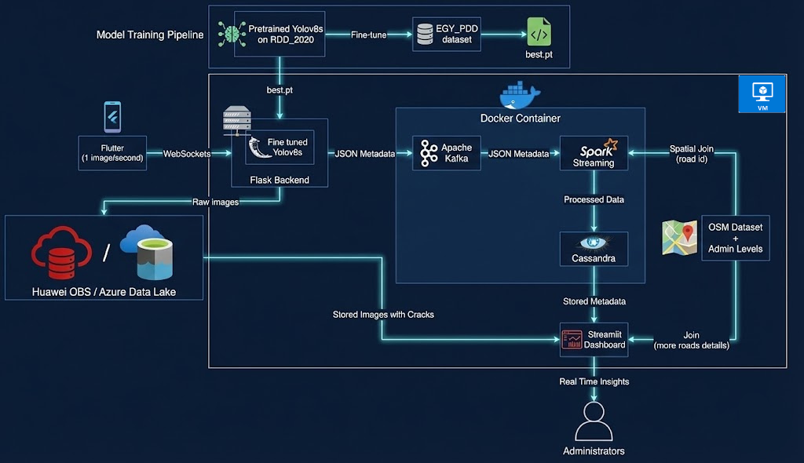

<div align="center">

# 👁️‍🗨️ PavementEye
### Automated Road Distress Detection & Classification System


<br/><br/>


</div>

---

## 🏆 Project Context
> **Huawei Developer Competition Northern Africa 2025**

**PavementEye** is an end-to-end streaming data pipeline that leverages Deep Learning and Big Data technologies to automate road inspection. It was deployed on both **Huawei ECS** and **Azure VM**, utilizing scalable storage solutions like **Huawei OBS** and **Azure Data Lake**.

---
<div align="center">
  
 ## 🎥 Project Demo

| **Arabic Demonstration** | **English Demonstration** |
|:---:|:---:|
| [🎬 Watch Video](https://drive.google.com/file/d/1YwlugCywoA-7TDtPUhG2Sqd1EKhO7w5V/view?usp=sharing) | [🎬 Watch Video](https://drive.google.com/file/d/1AJqbj6kvekrZlnUmwK3ukQi1raCHPbCU/view?usp=sharing) |
---
</div>


## 🧐 About the Project

### The Problem
Roads are the most widely used transportation method globally. However, road distresses (cracks, potholes) significantly degrade ride quality and motorist safety [1].
* **Manual Inspection:** Traditional visual observation is inconsistent, time-consuming, and prone to human error [3].
* **High Cost:** Specialized quantitative analysis machines are prohibitively expensive.
* **Maintenance Delays:** Lack of timely data leads to traffic congestion and costly emergency repairs [2].

### The Solution: PavementEye
We leverage **Data Science** and **Data Engineering** to transform road inspection into an automated intelligence pipeline.

1.  **Ingestion:** Automatically collects streaming images from road cameras.
2.  **Detection:** Uses **YOLOv8** deep learning models to detect and classify cracks.
3.  **Enrichment:** Integrates with **OpenStreetMap** to tag distress points with precise geolocation data.
4.  **Storage:** Archives raw images in a Data Lake (Cloud) and structured analytics in a NoSQL database.
5.  **Visualization:** Presents a unified dashboard for administrators to view live road health and calculated **PCI (Pavement Condition Index)**.

<div align="center">
  
</div>

---

## 🚀 Key Features

* **⚡ Real-Time Streaming:** Processes data instantly using Apache Spark and Kafka for immediate anomaly detection.
* **🧠 Advanced AI Analysis:** Fine-tuned Computer Vision models specifically for the *EGY_PDD* dataset.
* **🌍 Geospatial Intelligence:** Maps specific cracks to road networks using OpenStreetMap data.
* **☁️ Multi-Cloud Support:** Configurable to run on **Huawei Cloud (OBS/ECS)** or **Microsoft Azure**.
* **📊 Smart Dashboard:** Automatic calculation of PCI with an integrated AI Chatbot for data querying.
* **🛡️ Scalable Storage:** Fault-tolerant architecture using Apache Cassandra and Cloud Object Storage.

---

## 🏗️ System Architecture & Pipeline

<div align="center">
  
</div>

### Flow Overview
1.  **Image Collection:** Source devices stream video data.
2.  **Streaming Engine:** Kafka buffers data; Spark Streaming processes it.
3.  **AI Inference:** The Deep Learning model identifies crack types.
4.  **Persistence:**
    * Images $\rightarrow$ **Huawei OBS / Azure Data Lake**
    * Metadata $\rightarrow$ **Cassandra (NoSQL)**
5.  **Presentation:** Streamlit dashboard consumes data via WebSockets.

---

## 📂 Repository Structure

```bash
PavementEye/
│
├── 🔧backend/             # Flask backend (API, logic, model loading)
│   └── app.py             # Backend entry point
│
├── 📊streamlit/           # Streamlit dashboard (UI and visualization)
│   └── page 1.py          # Dashboard entry point
│
├── ⚡scripts/             # Automation scripts
│   ├── run.ps1            # Master execution script (PowerShell)
│   ├── cassandra.cql      # Database schema creation queries
│   └── spark.py           # Spark Structured Streaming entry point
│
├── 🗄️data/                # Local data (Cloud credentials in hidden .env)
│
├── 🤖models/              # YOLOv8 models
│   └── fine_tunning/      # Custom weights (Fine-tuned on EGY_PDD)
│
├── 📓notebooks/           # Jupyter notebooks for EDA and testing
├── 📱flutter_application_1/ # Mobile application source code
├── 📚media/               # Assets, diagrams, and reports
├── 🐳docker-compose.yml   # Main container orchestration
├── 🐳compose2.yaml        # Legacy/Alternative container orchestration
└── 🧠requirements.txt     # Python dependencies
```
---

As part of **"Huawei Developer Competition Northern Africa 2025"**, We used Huawei OBS and Huawei ECS, To use Huawei OBS other than Azure Data lake go to `backend/model.py` at the end of the file and uncomment or comment based on want you want to use (Azure data lake or Huawei OBS). The system was also deployed on both Huawei ECS and Azure VM.

## 💡 what Pavement-eye offers ?

1. A fast, reliable, and sustainable method for automatically detecting cracks using image processing—reducing manual effort and operational costs.

2. Utilizes persistent, fault-tolerant, and scalable storage solutions to manage various data types—including images, metadata, and analytics—ensuring high availability and data integrity.

3. Incorporates detailed spatial data, such as road networks from OpenStreetMap, to enable precise geolocation analysis and identify areas where cracks frequently occur.

4. Processes streaming data in real time, allowing immediate detection and classification of cracks for proactive infrastructure monitoring.

5. A centralized dashboard provides administrators with real-time visual insights, enabling quick identification and localization of cracks across monitored regions.

6. Automatically computes PCI to assess surface degradation and prioritize maintenance.

7. AI chatbot to make the analysis easier and enrich it.

<div align="center">
  
</div>


## ⚙️ Steps to run the code
The steps are so easy as we used commands to automate every thing:

1. Clone the repository

```powershell
git clone https://github.com/yahia997/PavementEye.git
cd PavementEye
```

2. Intsall required python libraries:
```powershell
pip install -r requirements.txt
```

3. Before you run the system, create a cassandra keysapce and table. The details of creation can be found in `scripts/cassandra.cql`. It contains all queries used for the creation.

4. Just type this in terminal and every thing will be ready:
```powershell
cd scripts
./run.ps1
```

**Note: If you get an error that indicates `bitnami/spark:latest` was removed from docker hub, just change `bitnami/spark:latest` to `bitnamilegacy/spark:latest` in `compose.yaml` in the part of spark-master and spark-worker.**

Or you can use this to run docker containers:
```powershell
docker compose -f compose2.yaml up -d
```

You can read more information about that here: https://hub.docker.com/r/bitnami/spark

**Note:** If you want to test cloud storage for images storage please contact yahiamahmoood333@gmail.com to get access credentials that are in hidden `.env` file.

---

## 📅 Work Timeline
<div align="center">  </div>

## 👥 The Team
| Name         | Actual Work Summary                                                                                       |
| ------------ | --------------------------------------------------------------------------------------------------------- |
| **Yahya**    | Team Leader, Data Engineering (Spark, Cassandra, kafka), Docker,Computer Vision (fine tuning on EGY_PDD dataset), Cloud Computing (Azure VM and Datalake and Huawei Cloud ECS and OBS), Backend Development and websocket connection, Flutter Development, Streamlit dashboard |
| **Mohamed**  | Huawei Cloud, Data Visualization, Streamlit Dashboard, Test Case Support, Video Editing, AI Chatbot                  |
| **Rowan**    | Apache Spark, Data Visualization                                                                                      |
| **Doaa**     | Flutter Development, Apache Spark                                                                         |
| **Salsabel** | Apache Spark, Data Visualization                                                                          |

---


## 🔗 References
[1]: Huang, Y.-H., & Zhang, Q.-Y., “A review of the causes and
effects of pavement distresses”, Construction and Building
Materials, Vol. 112, No. 1, pp. 294-305, 2016.

[2]: Kulshreshtha, S., & Zhang, X., “Pavement distresses and
their impact on pavement performance”, Journal of
Transportation Engineering, Part B: Pavements, Vol. 143,
No. 1, pp. 1-10, 2017.

[3]: Road Damage Detection Using Deep Neural Networks with
Images Captured Through a Smartphone, 2 Related Works
2.1 Road Damage Detection, Page 2

[4]: M. F. Abdelkader, M. A. Hedeya, E. Samir, A. A.
El-Sharkawy, R. F. Abdel-Kader, A. Moussa, and E. ElSayed, “Egy pdd: a comprehensive multi-sensor benchmark dataset for accurate pavement distress detection and
classification,” Multimedia Tools and Applications, vol. 84,
pp. 38509–38544, Sep 2025.

[5]: [Open street map dataset (Collected by geofabrik)](https://download.geofabrik.de/africa/egypt.html)

[6]: [More info about EGY_PDD dataset](https://psu.edu.eg/en/egy_pdd-dataset/)

---

## 📄License
This project is protected under an “All Rights Reserved” license.  
No part of this repository may be copied, modified, or distributed without permission.  
See the [LICENSE](LICENSE) file for more details.


[7]: [Egyptian administration levels dataset](https://data.humdata.org/dataset/cod-ab-egy)
