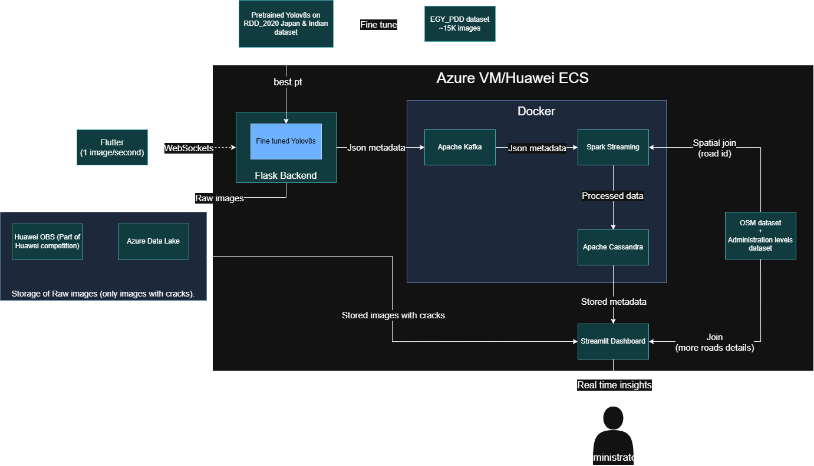

<div align="center">

# PavementEye
  


</div>

## 📂 Repository Structure summary
```bash
PavementEye/
│
├── backend/          # Flask backend (API, logic, model loading)
    │...
    └── app.py        # start point of the backend
├── streamlit/        # Streamlit dashboard (UI and visualization)
    │...
    └── page 1.py     # start point of streamlit dashboard    
├── scripts/          # all scripts and commands used in the project
    │...
    ├── run.ps1       # script to run the project
    └── spark.py      # start point of spark streaming   
├── data/             # (most of them are hidden, only files needed for run are included)
├── models/           # YOLO v8s models and fine tuning
    │...
    └── fine_tunning/ # directory contains our fine tuning (weights are hidden)  
├── notebooks/        # Jupyter notebooks for analysis and temporary work
├── flutter_application_1/
├── media/
    │...
    └── Technical_report_PavementEye.pdf
├── docker-compose.yml 
├── compose2.yaml     # alternate compose file for deleted images 
├── requirements.txt  # Project dependencies
└── README.md         # Project overview and setup guide
```

## 👁️‍🗨️ What is PavementEye ?
### Demo Video in Arabic: https://drive.google.com/file/d/1YwlugCywoA-7TDtPUhG2Sqd1EKhO7w5V/view?usp=sharing

### Demo Video in English: https://drive.google.com/file/d/1AJqbj6kvekrZlnUmwK3ukQi1raCHPbCU/view?usp=sharing

#### Introduction
Roads  are  the  most  widely  used  transportation method  around  the  world  at  present.  One  of the causes  of accidents on the roads  is road  distresses [1]. 

If left untreated,  road  distresses  will  degrade  the  ride quality and safety of motorists. They will also require costly  maintenance  and  repairs,  which  can  restrict traffic flow  and cause congestion. Therefore, timely maintenance is  essential  to keep  highways safe  and durable. [2]

#### Problem

Roadsurface inspection is primarily based on visual observations by humans and quantitative analysis using expensive machines. Furthermore, it is timeconsuming. visual inspection tends to be inconsistent and unsustainable, which increases the risk associated with aging road infrastructure.[3]

#### Solution
We leverage our expertise in data science and data engineering to transform collected ideas and information into a comprehensive streaming data pipeline. This pipeline automatically collects images, processes them to detect cracks and classify their types using deep learning model, and performs data preprocessing. It enriches the analysis through integration with OpenStreetMap, enabling advanced geolocation insights. Images are stored in the cloud (data lake), while structured data is saved in a NoSQL database. All results are visualized in a unified dashboard, providing administrators with rapid, actionable insights. We called the application “Pavement Eye”.

<div align="center">
  
</div>

## 🔄 Data Pipeline
<div align="center">
  
</div>

As part of **"Huawei Developer Competition Northern Africa 2025"**, We used Huawei OBS and Huawei ECS, To use Huawei OBS other than Azure Data lake go to `backend/model.py` at the end of the file and uncomment or comment based on want you want to use (Azure data lake or Huawei OBS). The system was also deployed on both Huawei ECS and Azure VM.

## 💡 what Pavement-eye offers ?

1. A fast, reliable, and sustainable method for automatically detecting cracks using image processing—reducing manual effort and operational costs.

2. Utilizes persistent, fault-tolerant, and scalable storage solutions to manage various data types—including images, metadata, and analytics—ensuring high availability and data integrity.

3. Incorporates detailed spatial data, such as road networks from OpenStreetMap, to enable precise geolocation analysis and identify areas where cracks frequently occur.

4. Processes streaming data in real time, allowing immediate detection and classification of cracks for proactive infrastructure monitoring.

5. A centralized dashboard provides administrators with real-time visual insights, enabling quick identification and localization of cracks across monitored regions.

6. Automatically computes PCI to assess surface degradation and prioritize maintenance.

<div align="center">
  
</div>


## ⚙️ Steps to run the code
The steps are so easy as we used commands to automate every thing:

1. Clone the repository

```powershell
git clone https://github.com/yahia997/PavementEye.git
cd PavementEye
```

2. Intsall required python libraries:
```powershell
pip install -r requirements.txt
```

3. Just type this in terminal and every thing will be ready:
```powershell
cd scripts
./run.ps1
```

**Note: If you get an error that indicates `bitnami/spark:latest` was removed from docker hub, just change `bitnami/spark:latest` to `bitnamilegacy/spark:latest` in `compose.yaml` in the part of spark-master and spark-worker.**

Or you can use this to run docker containers:
```powershell
docker compose -f compose2.yaml up -d
```

You can read more information about that here: https://hub.docker.com/r/bitnami/spark


**Note:** If you want to test cloud storage for images storage please contact yahiamahmoood333@gmail.com to get access credentials that are in hidden `.env` file.

## License
This project is protected under an “All Rights Reserved” license.  
No part of this repository may be copied, modified, or distributed without permission.  
See the [LICENSE](LICENSE) file for more details.

## 🔗 References
[1]: Huang, Y.-H., & Zhang, Q.-Y., “A review of the causes and
effects of pavement distresses”, Construction and Building
Materials, Vol. 112, No. 1, pp. 294-305, 2016.

[2]: Kulshreshtha, S., & Zhang, X., “Pavement distresses and
their impact on pavement performance”, Journal of
Transportation Engineering, Part B: Pavements, Vol. 143,
No. 1, pp. 1-10, 2017.

[3]: Road Damage Detection Using Deep Neural Networks with
Images Captured Through a Smartphone, 2 Related Works
2.1 Road Damage Detection, Page 2

[4]: M. F. Abdelkader, M. A. Hedeya, E. Samir, A. A.
El-Sharkawy, R. F. Abdel-Kader, A. Moussa, and E. ElSayed, “Egy pdd: a comprehensive multi-sensor benchmark dataset for accurate pavement distress detection and
classification,” Multimedia Tools and Applications, vol. 84,
pp. 38509–38544, Sep 2025.

[5]: [Open street map dataset (Collected by geofabrik)](https://download.geofabrik.de/africa/egypt.html)

[6]: [More info about EGY_PDD dataset](https://psu.edu.eg/en/egy_pdd-dataset/)

[7]: [Egyptian administration levels dataset](https://data.humdata.org/dataset/cod-ab-egy)
